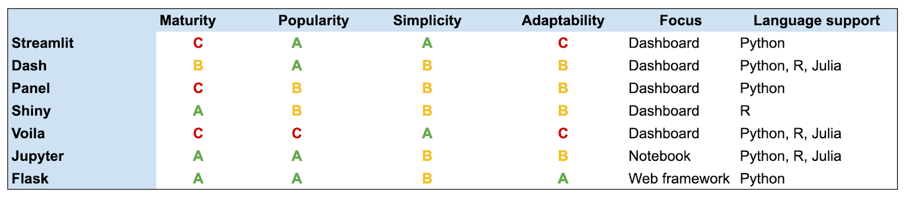

Plotly Open Source Data Visualization Library

## Plotly Components:
- Plotly Dash -> Web based analytic apps in Python, R
- Plotly Chart Studio -> Interactive web charts in **D3.js** and **Web GL**
- Plotly Open source graphing libraries in **plotly.py**, **plotly.r**, **plotly.js**

Plotly.py based on **Dash Open Source Framework**
Plotly.js based on Built on top of **d3.js** and **stack.gl** or **WebGL**

Plotly based on Json makes it adaptable

## Comparison between different data dashboarding technologies

## Additional Resources
[The only resource you need to compare multiple data dashboarding solutions](https://www.datarevenue.com/en-blog/data-dashboarding-streamlit-vs-dash-vs-shiny-vs-voila)
[Plotly js documentation](https://plotly.com/javascript)
